# Ruijie_JMU
集美大学锐捷 ePortal Web 认证自动登录脚本（Linux &amp; Windows）

### 特别声明

- 本程序仅为自动化登录脚本，不涉及任何破解盗版信息
- 仅供学习交流，严禁用于商业用途，请于24小时内删除
- 禁止将本站资源进行任何形式的出售，产生的一切后果由侵权者自负！

### 使用说明

#### Linux

macOS, OpenWrt 均适用~

1. 拉取代码

```bash
git clone https://github.com/ollyhsu/Ruijie_JMU.git /root/ruijie
```

2. 修改login.sh配置信息

```bash
sh /root/ruijie/ruijie_jmu.sh campus 202020200123 12345678 >> /root/ruijie/log.txt
```

> 请注意脚本执行路径，校园网服务为"campus"，中国电信为"chinanet"，中国移动为"chinamobile"，中国联通为"chinaunicom"
>
> 上面为格式示例：sh ruijie_jmu.sh 校园网服务 账号 密码

3. 创建cron服务

输入`crontab -e`编辑服务文件， 注意修改登录文件路径

```bash
*/5 6-23 * * * sh /root/ruijie/login.sh
```

#### Windows

1. 拉取代码

```powershell
git clone https://github.com/ollyhsu/Ruijie_JMU.git C:\Package\Ruijie_JMU
```

2. 修改仓库下的login.ps1内配置信息

```powershell
# C:\Package\ruijie_jmu\Windows\ruijie_jmu.ps1 campus 202020200123 12345678
```

> 请注意脚本执行路径，校园网服务为"campus"，中国电信为"chinanet"，中国移动为"chinamobile"，中国联通为"chinaunicom"
>
> 上面为格式示例：.\ruijie_jmu.ps1 校园网服务 账号 密码

3. 设置定时执行脚本

打开任务计划程序，选择创建基本任务，名称自定义，选择每天

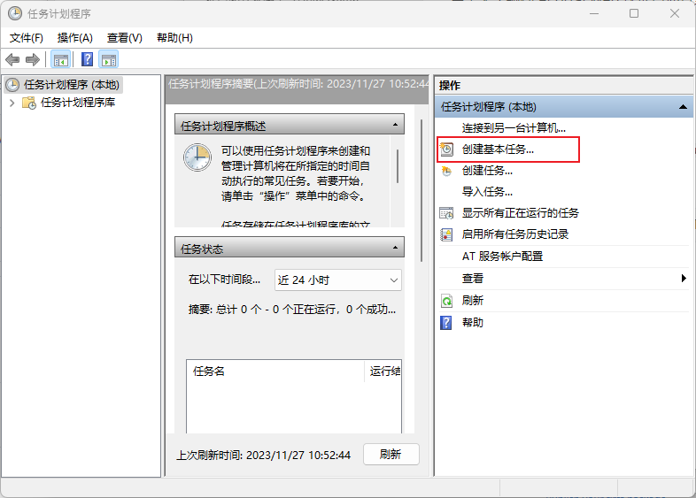

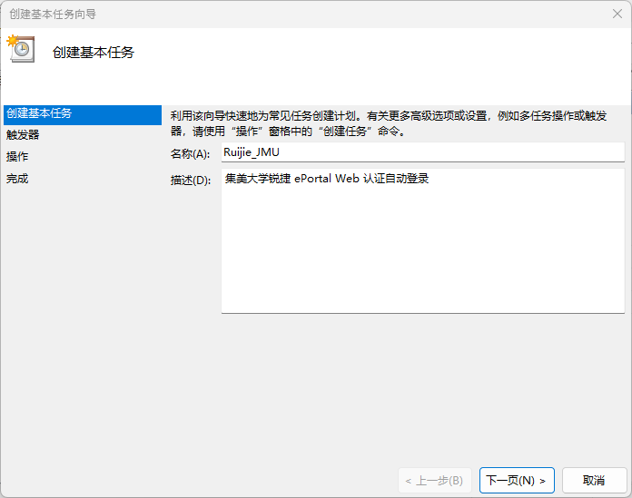

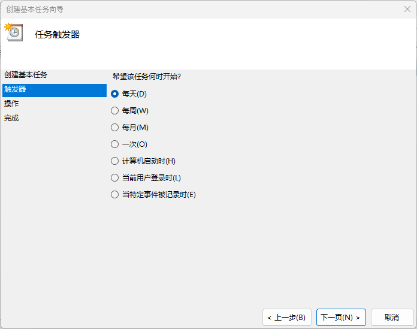


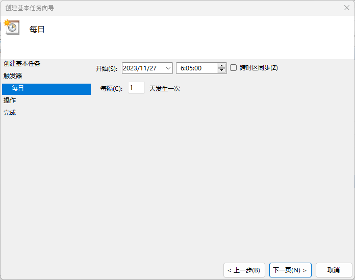

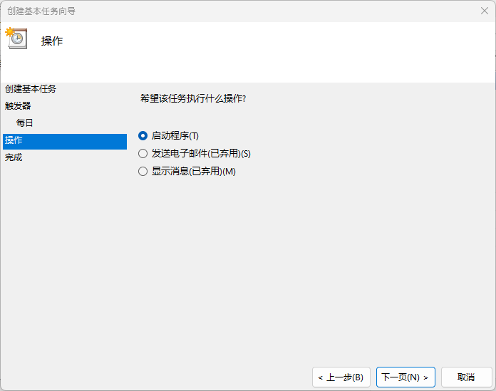

这里选择启动程序，下面输入路径：

```powershell
C:\Windows\System32\WindowsPowerShell\v1.0\powershell.exe
```

添加参数填写

```powershell
-command ". 'C:\Package\Ruijie_JMU\Windows\login.ps1'"
```

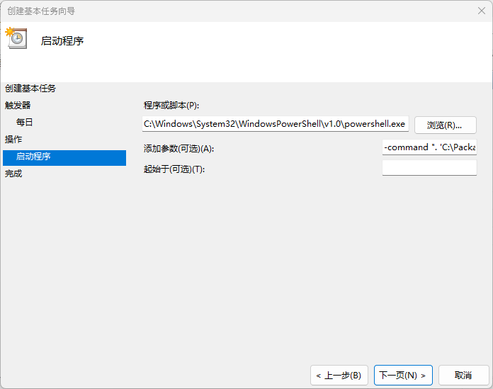

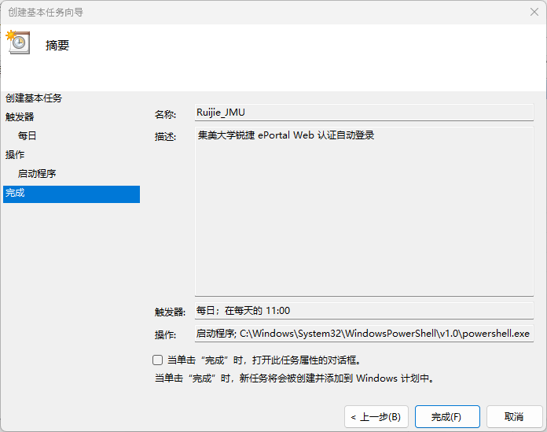

找到自己创建的定时任务，进行修改

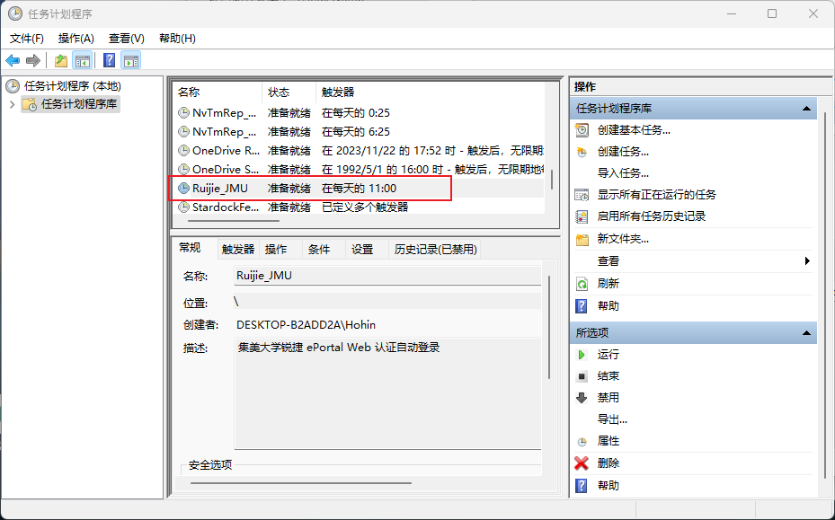


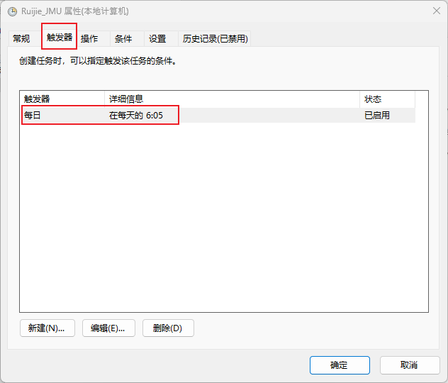

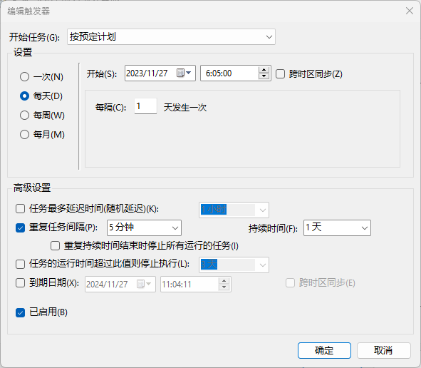

可以设置每天每隔5分钟执行一次

勾选`不管用户是否登陆都要运行`，即可在开机不登录的时候执行

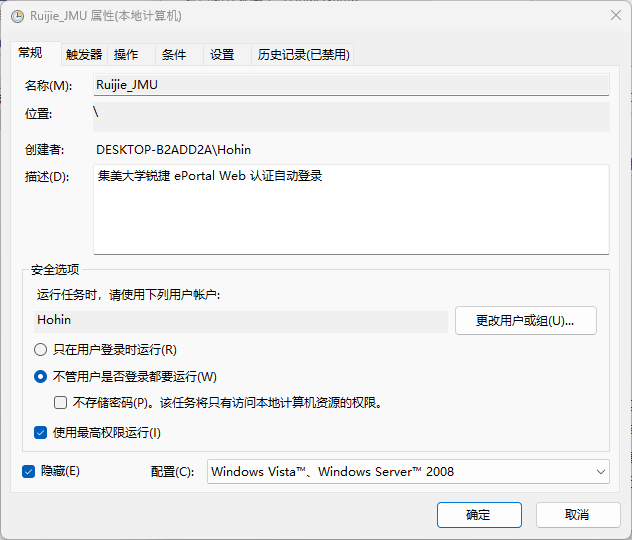

勾选`隐藏`，会默认后台执行，不会弹出终端~
